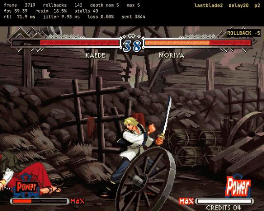

# Rollback Netcode Lab: Madrid ⇄ AWS Frankfurt

A Rust workspace that demonstrates rollback netcode at two levels:

1. A deterministic, fully instrumented **2D arena**. Every byte of state is
   auditable, the snapshot is 204 bytes, and the checksum covers all of it.
2. **The Last Blade 2** running on the official FBNeo core through the libretro
   API, driven by exactly the same rollback engine.

The local player drives P1 through SDL2. A headless EC2 instance in Frankfurt
drives P2 through a scripted FSM. The peers exchange only inputs, over UDP
authenticated with HMAC-SHA256, while Prometheus, Grafana, JSONL logs and an
HTML report record connectivity, predictions, rollbacks and desyncs.



*The Last Blade 2 under rollback. The band across the top is the session's own
telemetry, burned in from its log: 142 rollbacks so far, 18.5% of a frame's work
being re-simulated, and `ROLLBACK -5` firing on the frame it happened. The game
underneath does not stutter.*

## Results

Both simulations ran between a desktop in Madrid and an EC2 instance in
Frankfurt, over the public internet.

| | Arena | The Last Blade 2 |
|---|---|---|
| Snapshot size | 204 bytes | 415 155 bytes |
| CPU, 300 s session | ~2 s | ~116 s |
| Prediction accuracy | 91.7% | 92.9% |
| Checksums compared | 149 | 300 |
| Desyncs | 0 | 0 |

449 checksum comparisons agreed across two different CPUs, two operating systems
and two libcs. That is the evidence behind the determinism rules in
[05](docs/05-determinism.md), and two processes of one binary on one machine
could never have produced it.

Full numbers, including all five synthetic network profiles, are in
[08 — Experiments](docs/08-experiments.md).

## Documentation

| Document | Subject |
|---|---|
| [00 — Glossary](docs/00-glossary.md) | Start here. Every technical term from scratch |
| [01 — Theory](docs/01-theory.md) | What rollback is, why it exists, what it costs |
| [02 — Architecture](docs/02-architecture.md) | The crates, and why the boundary sits where it does |
| [03 — Protocol](docs/03-protocol.md) | Datagram format, authentication, handshake |
| [04 — Running locally](docs/04-running-locally.md) | Controls, commands, a session end to end |
| [05 — Determinism](docs/05-determinism.md) | The rules that prevent desync, and how they were checked |
| [06 — AWS](docs/06-aws.md) | The infrastructure, the threat model, the session key |
| [07 — Dashboard](docs/07-dashboard.md) | Prometheus, Grafana, what each panel means |
| [08 — Experiments](docs/08-experiments.md) | Five profiles, the method, the results |
| [09 — The Last Blade 2](docs/09-the-last-blade-2.md) | The FBNeo core, the boot script, the pinned commit |
| [10 — Costs](docs/10-costs.md) | What a session costs, and where money disappears |
| [11 — Cleanup](docs/11-cleanup.md) | How to destroy everything and confirm it went |
| [12 — Troubleshooting](docs/12-troubleshooting.md) | Symptoms, causes, what to look at first |
| [13 — Coverage](docs/13-coverage.md) | What was validated, what was not |
| [14 — Video](docs/14-video.md) | Recording sessions, and watching rollback happen |
| [15 — Elastic](docs/15-elastic.md) | Per-event analysis: what `summary.csv` cannot answer |

## Quick start

### Prerequisites

| Tool | For | Check |
|---|---|---|
| Rust ≥ 1.82 | building everything | `cargo --version` |
| SDL2 ≥ 2.0.20 | the graphical client | `pkg-config --modversion sdl2` |
| Docker | FBNeo build, Prometheus, Grafana, Elastic | `docker --version` |
| ffmpeg | recording sessions (optional) | `ffmpeg -version` |
| `just` | the commands below | `just --version` |
| Terraform ≥ 1.6 | AWS infrastructure | `terraform version` |
| AWS CLI | `aws-up`, `collect`, `aws-down` | `aws sts get-caller-identity` |
| shellcheck | the script lint gate | `shellcheck --version` |

x86_64. The observability `docker-compose` uses host networking and is therefore
Linux-only; the reason is written in the file itself.

### A full test, no AWS and no ROM

```bash
just test        # fmt, clippy, tests (debug and release), shellcheck, terraform, docs
just e2e         # two real processes, a real socket, all five profiles
just bench       # 180 s per profile, writes summary.csv and report.html
```

`just bench` produces `artifacts/report/summary.csv`, one row per session across
about 37 columns, and `artifacts/report/report.html`, which is self-contained:
no CDN, no script, charts as inline SVG.

### Local observability

```bash
just local-up
# Grafana     http://127.0.0.1:3000
# Prometheus  http://127.0.0.1:9090
# Exporter    http://127.0.0.1:9898/metrics
```

### A session against AWS

```bash
cp terraform/example.tfvars terraform/terraform.tfvars
$EDITOR terraform/terraform.tfvars     # allowed_cidr = your address, as a /32
curl -s https://checkip.amazonaws.com  # to find it

just aws-up arena
just play arena
just collect      # ALWAYS before aws-down
just aws-down
```

### The Last Blade 2

You supply the ROM. It needs `neogeo.zip`, the Neo Geo BIOS, in
`artifacts/system/`: a Neo Geo game is only half the code that runs, and the
BIOS is hashed into the handshake alongside the ROM.

```bash
just build-core                                  # builds FBNeo in a container
just check-determinism /path/lastbld2.zip        # check the core before anything
just e2e 90 lastblade2 /path/lastbld2.zip
just aws-up lastblade2 /path/lastbld2.zip
just play lastblade2 /path/lastbld2.zip
```

`just check-determinism` is not fussiness. FBNeo as shipped seeds its RNG and
its emulated calendar clock from the host clock, so two peers that start in
different wall-clock seconds diverge before the first input. `just build-core`
patches that; the measurement and the fix are in
[05 — Determinism](docs/05-determinism.md).

## What this repository does not contain

No ROMs and no BIOS. `lastbld2.zip` and `neogeo.zip` are yours, and are never
committed, redistributed, or included in any artefact here.

No savestates or personal logs. All of `artifacts/` is gitignored.

No keys. The session key is ephemeral, generated per run, kept in SSM
SecureString and in a local file with mode 0600, and never enters Terraform
state or a command line.

## Street Fighter Alpha 3

The lab specification named SFA3, and the code still carries the boot script and
the `--sim sfa3` path. It was never run, because the available romset is
missing `sfa3.key`, the 20-byte CPS-2 decryption key. All eleven SFA3 variants
in FBNeo require one, so no other revision avoids it.

The Last Blade 2 took its place. It exercises the same core, the same libretro
host, the same `LibretroSimulation` and the same rollback engine, so the thing
being demonstrated is unchanged. The full diagnosis, down to the FBNeo source
that makes the key mandatory, is in
[09 — The Last Blade 2](docs/09-the-last-blade-2.md).

Nothing in the measured results depends on SFA3, and nothing claims it ran.

## Out of scope

STUN, relay, matchmaking, spectating, reconnection, state synchronisation,
Tekken 3, vision-based AI, memory-reading bots, and multiple regions. Fightcade
is a reference point, not a dependency.
