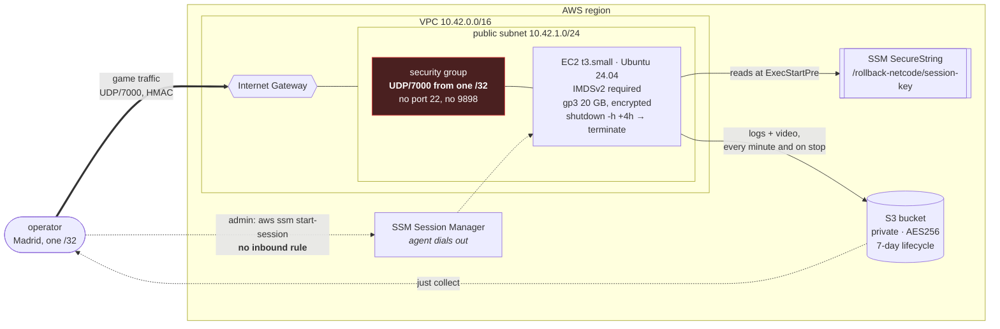

# 06 — AWS

## What gets built

21 resources, all in `terraform/`:

```
VPC 10.42.0.0/16
 └─ public subnet 10.42.1.0/24  ──  Internet Gateway  ──  route table
     └─ EC2 t3.small, Ubuntu 24.04 x86_64
         ├─ Elastic IP                 stable address across rebuilds
         ├─ gp3 20 GB volume           encrypted, delete_on_termination
         ├─ security group             UDP/7000, from one /32, nothing else
         ├─ IAM role                   SSM Core + minimal bucket access
         └─ IMDSv2 required

S3 bucket        private, AES256, 7-day lifecycle, force_destroy
SSM SecureString /rollback-netcode/session-key
```

And how the traffic actually moves. Note that only one arrow points *inward*:



The dotted lines are the ones that need no open port. Administration goes
through SSM, whose agent dials out, so there is no SSH, no bastion, and no rule
for port 22 to forget to remove.

## Threat model

The entire attack surface is **one UDP port, from one IP address**.

### No SSH

No key pair, no rule for port 22, no bastion. Administration goes through SSM
Session Manager, which needs **no** inbound rule at all. The agent dials out.

```bash
aws ssm start-session --region eu-central-1 --target i-0abc123...
```

A lab that opens 22 "just for debugging" is a lab with a permanent hole in it.

### No exposed dashboard

The Prometheus exporter listens on `127.0.0.1:9898`. There is no metrics port
open on any public interface, at either end. The remote peer's numbers arrive
over **the session's own link**, as `TelemetrySummary`, and are re-exported
locally with `peer="remote"`.

That is also why the observability `docker-compose` uses host networking: a
container on the default bridge simply cannot reach a loopback listener on the
host, and the alternative would be binding the exporter to `0.0.0.0`, trading
the lab's one real security property for a container convenience.

### `allowed_cidr` refuses `0.0.0.0/0`

```hcl
validation {
  condition     = var.allowed_cidr != "0.0.0.0/0"
  error_message = "Refusing to open the game port to the whole internet."
}
```

Not a suggestion. Terraform fails.

Find your address with `curl -s https://checkip.amazonaws.com` and use a `/32`.

### IMDSv2 required

`http_tokens = "required"`, `http_put_response_hop_limit = 1`. Requiring the
token is what stops a confused-deputy read of the instance credentials through a
request the application was tricked into making.

### Minimal IAM

The role carries `AmazonSSMManagedInstanceCore` and three more permissions, each
scoped to the exact resource: list **this** bucket, read/write/delete objects in
**this** bucket, read **this** parameter.

### A hardened systemd unit

The peer service runs with `NoNewPrivileges`, `PrivateTmp`,
`ProtectSystem=strict` and `ProtectHome`, with write access only to
`/opt/rollback/artifacts` and `/opt/rollback/secrets`.

## The session key

This is where most labs leak a secret, so the flow is worth spelling out:

1. `just aws-up` generates 32 bytes from `/dev/urandom` **on your machine**.
2. Writes it to SSM as a `SecureString` via `aws ssm put-parameter`.
3. Writes a local copy to `artifacts/session.key`, mode 0600.
4. The instance reads it from SSM in the service's `ExecStartPre` and writes
   `/opt/rollback/secrets/session.key`, mode 0600, owned by root.
5. `run-peer.sh` exports it from there into the process environment.

What does **not** happen:

- The key never enters Terraform state. The `aws_ssm_parameter` resource is
  created with a placeholder and carries
  `lifecycle { ignore_changes = [value] }`. Using `random_password` would put
  the value in cleartext in `.tfstate`.
- The key never becomes a command-line argument. Arguments are visible in `ps`
  to every user on the box. It arrives through `ROLLBACK_SESSION_KEY` or
  `ROLLBACK_SESSION_KEY_FILE`.
- The key never goes into a systemd `Environment=`, because that is readable by
  anyone through `systemctl show`.

And `just aws-down` deletes the local copy: a key on disk with no session behind
it is pure liability.

## Automatic shutdown

Two layers, because a forgotten instance is this lab's most expensive failure
mode:

```hcl
instance_initiated_shutdown_behavior = "terminate"
```

```bash
shutdown -h "+$((AUTO_SHUTDOWN_HOURS * 60))"
```

User-data arms a `shutdown` for four hours after boot. Because the shutdown
behaviour is *terminate* rather than *stop*, the deadline is real. This is not a
way to accumulate stopped instances with volumes still billing.

Adjustable through `auto_shutdown_hours` (1 to 12; Terraform refuses more).

## Installing and running remotely

User-data **compiles nothing**. A t3.small building FBNeo would take longer than
the whole session. It installs the minimum, creates the tree under
`/opt/rollback`, arms the log-sync timer, and stops.

`just aws-up` then:

1. builds `rollback-bot` locally, in release;
2. uploads the binary to S3, plus the core, the ROM and `neogeo.zip` for an
   emulated game;
3. sends an SSM command that pulls it all down, fetches the launcher, and runs
   `systemctl restart rollback-bot`.

The launcher script is **generated locally and shipped as a file**, not written
by a `printf` inside the SSM command. The reason is below.

## Log sync

A systemd timer runs `rollback-sync-logs` every minute, and the unit also runs
it on `ExecStop`, the shutdown path, which is when it matters most. So
`just collect` finds a complete set even if the session ended badly.

It syncs `artifacts/logs` and `artifacts/video`, and deliberately not
`artifacts/system`: that holds the BIOS and FBNeo's NVRAM, and re-uploading
someone's BIOS every minute is pointless traffic.

## Why Frankfurt

`eu-central-1` is the experiment, not a detail. Madrid to Frankfurt is far
enough that rollback is visible, 50 ms measured and three frames of it, and
close enough that the game stays playable. Changing the region changes the
result.

## Why t3.small, and when to change it

t3.small (2 burstable vCPU, 2 GiB) carries the arena with enormous headroom: two
seconds of CPU for a 240-second session.

The Last Blade 2 is a different matter. Measured on the real session, the remote
peer used 46 seconds of CPU over 300. Comfortable, but that was the peer doing
almost no rollback work. The local peer, doing 544 of them, used 116 seconds.
The bottleneck is `retro_serialize` every frame, plus up to eight re-simulations
in a deep rollback.

Signs it is time to move to `t3.medium`: `effective_fps` well below 60 on the
remote peer, or `advance + save_state` exceeding about 8 ms per frame, half the
budget, leaving room for the worst-case rollback.

```hcl
instance_type = "t3.medium"
```

## The full flow

```bash
cp terraform/example.tfvars terraform/terraform.tfvars
$EDITOR terraform/terraform.tfvars   # allowed_cidr = $(curl -s https://checkip.amazonaws.com)/32

just aws-up arena          # ~3 min: apply, key, upload, start
just play arena            # play
just collect               # ALWAYS before aws-down
just aws-down              # destroy everything
```

For the emulated game, with recording on both ends:

```bash
RECORD=1 SIM=lastblade2 ROM=/path/lastbld2.zip DURATION=150 ./ops/scripts/aws-up.sh
```

To review an infrastructure change without applying it: `just aws-plan`.

## Five things only a real `apply` found

Terraform passed `fmt` and `validate`, the scripts passed `shellcheck`, and the
first real session still took five attempts. Each one is worth recording,
because they are all of a class no local gate catches.

### 1. An apostrophe took down the apply

```
Error: creating VPC Security Group Rule
InvalidParameterValue: Invalid rule description. Valid descriptions are strings
less than 256 characters from the following set:  a-zA-Z0-9. _-:/()#,@[]+=&;{}!$*
```

The description read `"Rollback session traffic from the operator's address"`.
The apostrophe is not in the permitted set. `terraform validate` is perfectly
happy with it; only the AWS API refuses.

### 2. SSM runs `/bin/sh`, not bash

`AWS-RunShellScript` joins the commands into a script run by the default shell,
which on Ubuntu is **dash**. Two bashisms died there:

- `set -euo pipefail` → `set: Illegal option -o pipefail`
- `source /opt/rollback/env` → `source: not found`

Fixed with `set -eux` and `.` instead of `source`.

### 3. Ubuntu 24.04 no longer ships `awscli`

```
E: Package 'awscli' has no installation candidate
```

Noble dropped the package. Under `set -e` that kills `user_data` on its first
command and leaves an instance that **boots, answers SSM, and has nothing
installed**, a failure that is invisible from outside. The bootstrap now
installs AWS's official v2 bundle.

### 4. SSM Online does not mean bootstrap finished

The SSM agent is baked into the AMI and answers during boot, long before
`cloud-init` is done. Waiting for the ping and then sending the command races
the bootstrap and fails with `cannot open /opt/rollback/env`, which reads like a
broken script rather than "you were early".

`aws-up` now waits for the `/opt/rollback/BOOTSTRAP_COMPLETE` marker the
bootstrap writes when it genuinely finishes.

### 5. `printf %s` does not interpret `\n`

The remote launcher was written by a `printf` inside an SSM command, three
layers of quoting deep: bash string to JSON string to remote sh. And `printf %s`
does not interpret escapes, so the whole script landed on a single line:

```
/usr/bin/env bash\nset -euo pipefail\nexport ROLLBACK_SESSION_KEY=...
```

`env` spent minutes trying to execute a program named
`bash\nset -euo pipefail\n…`, and `systemctl is-active` reported **active** the
entire time.

The fix is structural rather than cosmetic: the launcher is generated locally
and uploaded as a file. A file in S3 has no escaping layer at all.

### The common thread

Four of the five failed **silently, or with apparent success**. `aws-up` would
reach the end printing "the remote peer is up" with the peer dead, and you found
out from the handshake timing out 120 seconds later with no explanation.

So the script now:

- waits for the SSM command to reach a terminal status instead of sleeping 8 s;
- **fails loudly** when the status is not `Success`, and says that the
  infrastructure is up and costing money;
- confirms with `ss -lun | grep -q :7000` that the peer is **actually
  listening**, and dumps the journal when it is not.

Verifying is cheap. Finding out from the handshake is not.

## Terraform state

The backend is local (`terraform/terraform.tfstate`) and gitignored.

For a one-person lab that is fine. If more than one person will operate the same
account, move to an S3 backend with DynamoDB locking before anything else. Two
concurrent applies over local state produce orphaned resources that only show up
on the bill.
