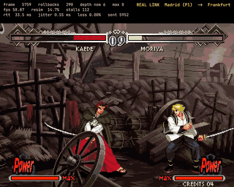

# 14 — Video: watching rollback happen

> Terms like *rollback*, *stall*, *depth* and *profile* are defined in
> [00 — Glossary](00-glossary.md).

## The problem with documenting rollback

Rollback works when you **cannot** tell. The correction happens inside one
display frame; the player sees a continuous game. Recording a session and
watching it proves the game ran and nothing else.

What turns a recording into documentation is putting the telemetry beside it.
The JSONL log already records every presented frame, every rollback with its
depth, every stall, so it can be burned into the video on the exact frame it
happened.


That is the point: a perfectly smooth fight while the counter runs past a
hundred corrections.

## How it works

```
rollback-bot --record session.mp4     presented frames -> ffmpeg -> H.264
        |
        +-- session.jsonl             per-frame events
                |
                v
   annotate-video.py                  JSONL -> ASS subtitles -> burned in
```

### The frames come from the simulation, not the screen

A screen recorder captures what the compositor happened to show, at whatever
rate it happened to composite. That is useless here, because the interesting
claim is about **which** frames reached the player.

`--record` writes exactly the frames produced in `OutputMode::Present`: one per
advanced frame, none of the re-simulated ones. So the file is, frame for frame,
what the player saw, and a 60 Hz recording of a session that held 60 Hz is proof
it held it.

Frames whose geometry differs from what ffmpeg was told are **counted and
dropped**, not written. A short frame would shift every byte after it and turn
the rest of the video into noise.

### Telemetry goes in a band, not over the game

Drawn on top, it collided with the game's own HUD. Health bars and the round
timer live in exactly that corner, and both became unreadable. The band costs a
little height and leaves the emulator's output untouched, which also means the
video still shows what the player actually saw.

The `ROLLBACK -N` marker stays over the picture, because there it is temporal
information, and it clears after 0.25 s. Stalls use the loud style and last as
long as they lasted.

## Making them

```bash
just record-scenarios /path/lastbld2.zip
just record-scenarios /path/lastbld2.zip 120 "natural combined"
```

Output lands in `artifacts/video/`: one video per peer per profile, plus a
side-by-side.

**Both** peers are recorded deliberately. Under any profile with delay the two
sides do wildly different amounts of work, and a single-peer video would show a
smooth fight and hide the entire phenomenon.

To annotate a recording you already have:

```bash
just annotate raw.mp4 session.jsonl out.mp4 "label"
```

## What each one shows

90 s per profile, bot against bot on loopback, seed 4242.

| Video | P1 | P2 | What to watch |
|---|---|---|---|
| `natural-both` | 0 rollbacks | 0 rollbacks | The control. Nothing happens: inputs arrive before they are needed. |
| `delay20-both` | 0 | 260, 40 stalls | The asymmetry. Same fight, same frame, one side doing all the work. |
| `jitter30-both` | 0 | 260, 39 stalls | Indistinguishable by eye from the last one. Jitter is not worse than delay for rollback. |
| `loss2-both` | 0 | 5 | Loss barely becomes rollback. The redundancy delivers the lost input before it is missed. |
| `combined-both` | 65 | 259, 40 stalls | Both sides working, and stalls you can see. |
| `aws-madrid-frankfurt-both` | 544, 133 stalls | 13 | The real link. |

### The real link



Madrid driving P1 against an EC2 instance in Frankfurt. Depth reaching 6, the
prediction limit touched at 8, and the fight running at 60 Hz through all of it.

### The frame that sums the project up

Pause any side-by-side at any moment. **Both halves show the same image, pixel
for pixel**, while the counters show completely different numbers.

Two machines running the same game. The work each one does to manage it has
nothing to do with the other.

## A methodological caveat

**Recording costs CPU, and CPU moves the measurement.**

Each `ffmpeg` takes about 65% of a core encoding 60 fps. On a loopback recording
that means two emulators and two encoders competing for one machine, and it
shows up in the numbers:

| `natural`, loopback | RTT p50 |
|---|---|
| ordinary session | 16.6 ms |
| recorded session | 38.0 ms |

RTT more than doubled, and none of it was the network. The frame loop got slower
because the machine was busy.

So:

- The numbers in [08 — Experiments](08-experiments.md) come from sessions
  **without** recording. Those are the measurement.
- The videos are illustration. They show the behaviour faithfully, including the
  asymmetry, the stalls and the frame-for-frame agreement, but the counters in
  them are inflated by the cost of recording.

Never quote a number read off a video. Quote `summary.csv` from the equivalent
un-recorded session.

## Limits

**Emulated simulations only.** The arena has no framebuffer; it is simulated,
not drawn, outside the SDL client. Recording it would need a software rasteriser
in the bot, which does not exist.

**No audio.** The host discards audio during re-simulation, and synchronising
what remains against the video is a problem of its own. The videos are silent.

**No pixel aspect correction.** Arcade output is not square-pixel. The video is
scaled 3× with nearest-neighbour and nothing else, so it looks stretched
compared to a CRT. That is deliberate: correcting it would mean choosing a ratio
the core never reported.
