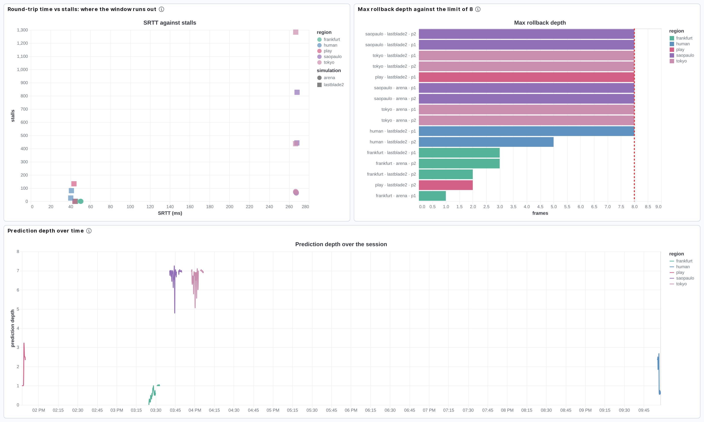
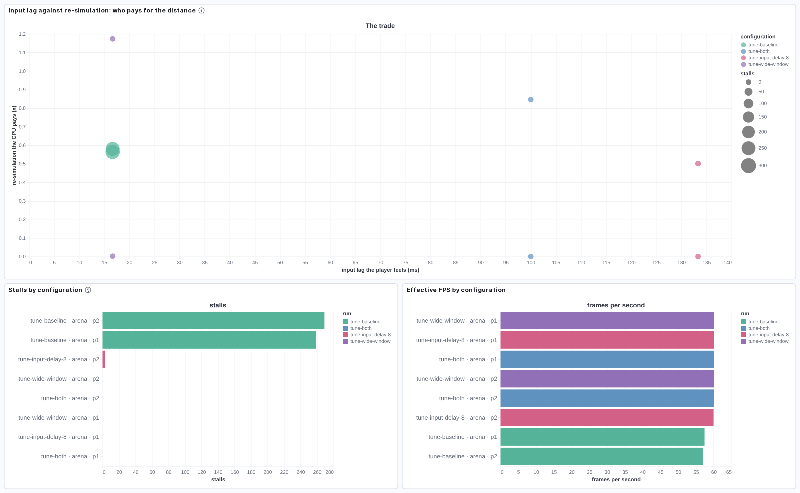
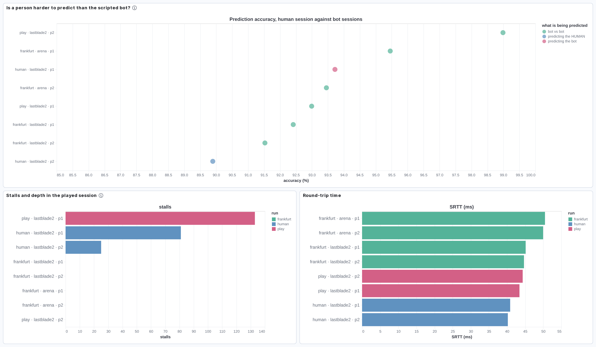

# 18 - Dashboards and queries

Everything this lab measured, in a form you can interrogate rather than read.
Six Kibana dashboards and twelve ES|QL queries, all built from the same two
indices, all reproducible from the repository.

```bash
just elastic-up                        # Elasticsearch + Kibana, localhost only
just elastic-load                      # index artifacts/logs
./ops/scripts/elastic-dashboards.py    # build the dashboards
./ops/scripts/elastic-esql.py          # run every query, print the tables
```

Kibana: http://127.0.0.1:5601. The dashboards are named `Rollback Lab - 1`
through `6`.

## What is in the indices

Two of them, both written by `ops/scripts/elastic-load.py` from the JSONL logs.

### `rollback-metrics`

One document per second per session: a snapshot of every counter at that
moment. 24 sessions, about 5 000 documents.

| Field | Meaning |
|---|---|
| `session` | the log's filename stem, unique per peer per run |
| `mode` | the run's label: `frankfurt`, `saopaulo`, `tokyo`, `human`, `tune-*` |
| `simulation` | `arena` or `lastblade2` |
| `player` | `p1` or `p2`, which side this log is from |
| `seed`, `input_delay`, `prediction_limit` | the configuration under test |
| `frame`, `confirmed_frame` | the two clocks: simulated, and settled |
| `prediction_depth` | the gap between them, right now |
| `local.frames_presented` | frames the player saw |
| `local.frames_resimulated` | frames run again during corrections, never shown |
| `local.rollbacks` | how many corrections happened |
| `local.max_rollback_depth` | the deepest single correction |
| `local.predicted_frames` | frames simulated with a guessed remote input |
| `local.mispredicted_frames` | how many of those guesses were wrong |
| `local.stalls` | frames where the window was full and the session waited |
| `local.checksums_compared` | desync checks that actually ran |
| `local.advance_nanos` / `save_state_nanos` / `load_state_nanos` | cumulative time in each |
| `local.state_bytes_max` | snapshot size: 204, or 415 155 |
| `link.srtt_micros`, `link.rttvar_micros` | smoothed round trip and its variation |
| `link.packets_sent` / `unique_received` / `highest_sequence` | what crossed the wire |
| `link.auth_failures`, `link.malformed` | rejected datagrams; zero everywhere |
| `process.cpu_seconds`, `process.resident_bytes` | what the process cost the host |
| `derived.effective_fps` | presented frames over elapsed seconds |
| `derived.resimulation_overhead` | re-simulated over presented |
| `derived.srtt_ms`, `derived.rttvar_ms`, `derived.loss_pct` | the same, in readable units |

**The counters are cumulative.** A session's final value is `MAX(counter)`;
averaging one across a session is meaningless. Rates (`derived.effective_fps`,
`derived.srtt_ms`) are instantaneous, so those take `AVG`. Every query here
follows that rule and every panel does too.

### `rollback-events`

One document per event: 260 000 of them.

| `event` | Meaning | Extra fields |
|---|---|---|
| `advanced` | a frame was simulated and shown | `predicted` (was the remote input a guess?) |
| `rolled_back` | a correction happened | `depth`, `from`, `to` |
| `stalled` | the window was full | `waiting_for` (the frame it needed) |
| `checksum_matched` | a desync check passed | `frame`, `checksum` |
| `desync` | the peers disagreed | `local_checksum`, `remote_checksum` |

Loading with `--all` adds per-datagram records, which is another 200 MB and
only worth it when chasing a specific packet.

## The dashboards worth looking at

Six exist. Three carry findings the tables cannot show as well; the other three
(`1. Overview`, `3. Corrections`, `6. Frame cost`) are useful for browsing but
say the same thing a query says faster.

Reading them: **every row is one peer of one session**, labelled
`mode · simulation · player`. The two peers of a run appear as separate rows on
purpose, because they do not experience the session the same way.

### 2. Distance: where the prediction window runs out



**Left, SRTT against stalls.** Each mark is one peer. Horizontal axis is
measured round-trip time; vertical is how many frames that peer had to freeze.
Circles are the arena, squares The Last Blade 2, colour is the region.

The picture is two clusters and nothing between them. At 40-50 ms every session
sits on the floor: zero stalls. At 265-270 ms every session is somewhere between
70 and 1 300. There is no gradual degradation, because the mechanism is not
gradual: either an input arrives inside the 8-frame window or it does not.

Note the squares sit far above the circles at the same distance. Same link, same
frame budget; the difference is that recovering from a stall means re-simulating
up to eight frames, and eight frames of a 415 KB emulator costs what eight
frames of a 204-byte arena does not.

**Right, max rollback depth.** The red dashed line is `prediction_limit`, 8.
Frankfurt's bars stop at 1-3. Every long-distance bar is pinned exactly at the
line, which is the session refusing to speculate further rather than a
coincidence.

**Bottom, prediction depth over time.** The same measurement as a time series,
one line per region, sampled every 10 seconds. Frankfurt hugs 1. São Paulo and
Tokyo sit between 6 and 7 for their entire runs, jittering against the ceiling.
A session at the limit is not occasionally struggling, it is permanently there.

### 4. Tuning: who pays for a long link



Four configurations against the same synthetic 267 ms link, so the question
"how do you fix this" can be asked without renting an instance per attempt.

**Top, the trade.** Horizontal axis is input lag in milliseconds, which is what
the player feels. Vertical is re-simulation ratio, which is what the CPU pays:
1.0 means the machine simulated every frame twice. Bubble size is stalls.

Bottom-left is what everyone wants, and at this distance nobody can have it.
The baseline (green, small lag, moderate CPU) is the configuration that freezes
269 times. Moving right buys smoothness with input lag; moving up buys it with
CPU. There is no configuration in the corner.

**Bottom, stalls and FPS per configuration.** Every alternative takes stalls to
zero and FPS back to 60. They differ only in who was charged.

The rows come in pairs because both peers are logged, and the pairs are not
symmetric: the peer whose frame clock starts later has almost nothing to
predict, so it shows near-zero re-simulation. The interesting row of each pair
is the one that is *ahead*.

### 5. Human against bot



The one session with a person on P1, against the bot-versus-bot runs over the
same route.

**Top, prediction accuracy.** Colour says what was being predicted. This is the
panel that overturned an assumption written into this repository's own
documentation.

The reasoning had been: bots change input on a fixed cadence, people hold
directions for long stretches, so bot-measured accuracy is a **floor** and a
human would be easier to predict. The measurement says the opposite. Predicting
the human scored **89.9%**, lower than every bot-versus-bot figure in the
dataset. Predicting the bot in the same session scored 93.7%.

One session, one player, recording on. It is a finding worth chasing, not a
conclusion, and [13 - Coverage](13-coverage.md) lists it as an open question
rather than a result.

**Bottom left, stalls.** The played session stalled 81 times on P1 despite a
*better* route than the bot runs (33 ms against 50). The cause is in the
recording: encoding video costs about 65% of a core, which slows the frame loop
and widens the phase gap between peers. A recorded session is good footage and a
worse measurement, which is why [08](08-experiments.md) draws its numbers from
un-recorded runs.

## The queries

`ops/elastic/queries.esql` holds twelve, each a named block. They are plain text
on purpose: paste one into Kibana's **Discover** in ES|QL mode and you get the
same table with a chart beside it.

```bash
./ops/scripts/elastic-esql.py --list        # names and descriptions
./ops/scripts/elastic-esql.py distance      # run one
./ops/scripts/elastic-esql.py --markdown    # tables ready to paste into docs
```

| Query | Answers |
|---|---|
| `sessions` | what was measured, and where |
| `distance` | what the round trip costs, region by region |
| `saturation` | does one-way delay fit inside the prediction window? |
| `asymmetry` | which peer does the predicting, and why it swaps |
| `accuracy` | prediction accuracy for all 22 sessions |
| `human` | is a person harder to predict than the bot? |
| `tuning` | who pays for a 267 ms link |
| `cost` | where a frame's 16 667 microseconds go |
| `depth_histogram` | how deep the corrections actually go |
| `desync` | did the peers ever disagree (they did not) |
| `loss` | what the real links actually dropped |
| `stalls_over_time` | which frames the session waited on |

### The one that settles the headline

```esql
FROM rollback-metrics
| WHERE mode IN ("frankfurt", "saopaulo", "tokyo")
| EVAL one_way_ms = `derived.srtt_ms` / 2,
       window_ms = prediction_limit * 1000.0 / 60
| STATS one_way = ROUND(AVG(one_way_ms), 0),
        window = ROUND(AVG(window_ms), 0),
        depth = MAX(`local.max_rollback_depth`),
        stalls = MAX(`local.stalls`)
    BY mode
| EVAL fits_in_window = one_way < window
| SORT one_way
```

| one_way | window | depth | stalls | mode | fits_in_window |
|---|---|---|---|---|---|
| 23 | 133 | 3 | 0 | frankfurt | true |
| 133 | 133 | 8 | 1283 | tokyo | false |
| 134 | 133 | 8 | 827 | saopaulo | false |

Eight frames at 60 Hz is 133 milliseconds. Madrid to Tokyo is 133 milliseconds
one way. The window and the link are the same size, so an input cannot arrive
before the window that needs it has already filled, and the session waits
instead. Frankfurt has almost six times the headroom and never waits at all.

That is the entire result of the multi-region experiment, in six rows.

### What the links actually dropped

```esql
FROM rollback-metrics
| WHERE mode IN ("frankfurt", "saopaulo", "tokyo", "human")
| STATS loss_pct = ROUND(MAX(`derived.loss_pct`), 3),
        they_sent = MAX(`link.highest_sequence`),
        we_received = MAX(`link.unique_received`),
        auth_failures = MAX(`link.auth_failures`)
    BY mode, session
| EVAL dropped = (they_sent + 1) - we_received
| SORT loss_pct DESC
```

Two sessions to Tokyo lost 5 and 2 datagrams. Everything else lost nothing at
all, over 130 000 datagrams and six sessions on three continents.

Intercontinental fibre turns out to be **slow but almost perfectly clean**,
which is the opposite of what the synthetic `jitter30` and `loss2` profiles
assume. Those describe bad Wi-Fi, not a route between datacentres. It also means
the eight-input redundancy was never tested against the burst loss it exists to
survive, and [13 - Coverage](13-coverage.md) says so.

Note that loss is measured against the **peer's** sequence numbers, not against
our own send count. Those are unrelated counters, and comparing them invents
losses that never happened.

## Using the data for something else

The point of publishing this is that the questions above are not the only ones
the logs can answer.

```bash
tar xf dataset/rollback-sessions.tar.zst -C artifacts/   # the logs
just elastic-up && just elastic-load                     # index them
```

Everything is then queryable without running a single session or spending
anything on AWS. `dataset/README.md` describes the format and what each run was.

Questions this dataset could settle that nobody has asked it yet:

- Does rollback depth correlate with *what is happening in the match*? The
  events index has a document per frame, and the recordings are timestamped.
- How long does a stall actually last in wall-clock terms, and do stalls cluster?
  `stalls_over_time` starts on this and stops early.
- Is the prediction rule ("repeat the last confirmed input") beatable? The
  events index records every guess and every real input, so an alternative
  predictor can be scored offline against 240 000 real frames without touching
  the engine.

## Building the charts yourself

`ops/scripts/elastic-dashboards.py` builds every panel from a Vega-Lite spec in
Python. Panels are Vega rather than Lens deliberately: a Lens saved object
carries a large internal schema that shifts between Kibana versions, and when it
breaks you get an error box that names nothing. A Vega spec is a query and an
encoding, and the script checks both before writing anything.

```bash
./ops/scripts/elastic-dashboards.py --dry-run    # run every query, create nothing
```

That flag exists because of a specific failure: a panel whose query returns no
rows renders as an empty box, and an empty box is indistinguishable from a real
result of zero. The dry run prints a bucket count per panel and refuses to build
if any comes back empty, with one exception, the desync panel, which is empty on
purpose and is the most important panel in the set.

Two Kibana behaviours cost real time and are worth knowing before editing a
spec:

**Bars anchor at zero.** A bar chart whose x axis is zoomed to `[54, 61]` draws
every bar from 0 to its value, entirely outside the visible domain, and renders
blank with no warning. Anchoring with `x2` is what makes a zoomed bar chart
legal.

**Panels render lazily.** Kibana only draws a panel once it has scrolled into
view, so a screenshot of a tall dashboard captures its lower panels blank. The
screenshot tooling scrolls to the bottom and back before capturing.
